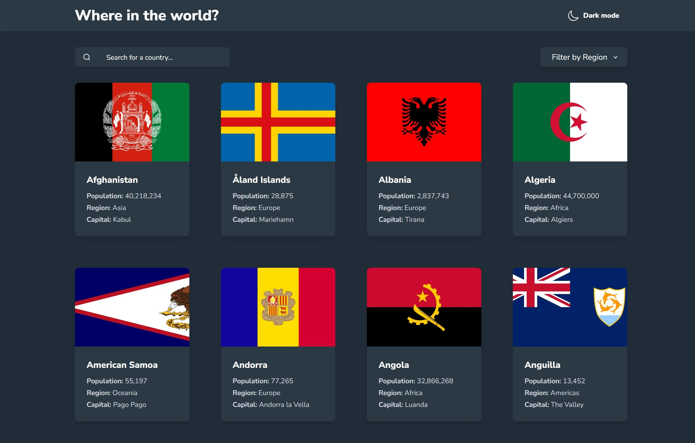

# Frontend Mentor - REST Countries API with color theme switcher solution

This is a solution to the [REST Countries API with color theme switcher challenge on Frontend Mentor](https://www.frontendmentor.io/challenges/rest-countries-api-with-color-theme-switcher-5cacc469fec04111f7b848ca). Frontend Mentor challenges help you improve your coding skills by building realistic projects. 

## Table of contents

- [Overview](#overview)
  - [The challenge](#the-challenge)
  - [Screenshot](#screenshot)
  - [Links](#links)
- [My process](#my-process)
  - [Built with](#built-with)
  - [What I learned](#what-i-learned)
  - [Continued development](#continued-development)
- [Author](#author)

## Overview

### The challenge

Users should be able to:

- See all countries from the API on the homepage
- Search for a country using an `input` field
- Filter countries by region
- Click on a country to see more detailed information on a separate page
- Click through to the border countries on the detail page
- Toggle the color scheme between light and dark mode *(optional)*

### Screenshot



### Links

- Solution URL: [solution URL](https://github.com/abok-cymk/rest-countries-api-with-color-theme-switcher-master)
- Live Site URL: [live site URL](https://abok-cymk.github.io/rest-countries-api-with-color-theme-switcher-master/)

## My process

### Built with

- Semantic HTML5 markup
- CSS custom properties
- Flexbox
- CSS Grid
- Mobile-first workflow
- [React](https://reactjs.org/) - JS library
- [Framer-Motion](https://www.framer.com/) Animation

### What I learned

Creating reusable components to reduce longer codebase

```jsx
import PropTypes from "prop-types";
import { memo } from "react";

const Button = ({
  text,
  icon,
  onClick,
  className = "",
  disabled = false,
  type = "button",
}) => {
  return (
    <button
      type={type}
      onClick={onClick}
      disabled={disabled}
      className={`
        flex items-center justify-center gap-2
        px-4 py-2  
        transition-all duration-200 cursor-pointer 
        ${className}
      `}
    >
      {icon && <span className="flex-shrink-0">{icon}</span>}
      {text && <span className="text-[0.875rem] font-800">{text}</span>}
    </button>
  );
};

Button.propTypes = {
  text: PropTypes.string,
  icon: PropTypes.node,
  onClick: PropTypes.func,
  className: PropTypes.string,
  disabled: PropTypes.bool,
  type: PropTypes.oneOf(["button", "submit", "reset"]),
};

export default memo(Button);
```

### Continued development

Making this fullstack is kind of something I am thinking for the future, incorporate `redis`, `mongodb` and `postgres` to perist data and improve performance by adding caching

## Author

- Frontend Mentor - [@abok-cymk](https://www.frontendmentor.io/profile/abok-cymk)
- Twitter - [@abokallan22](https://www.twitter.com/abokallan22)

